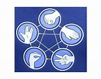
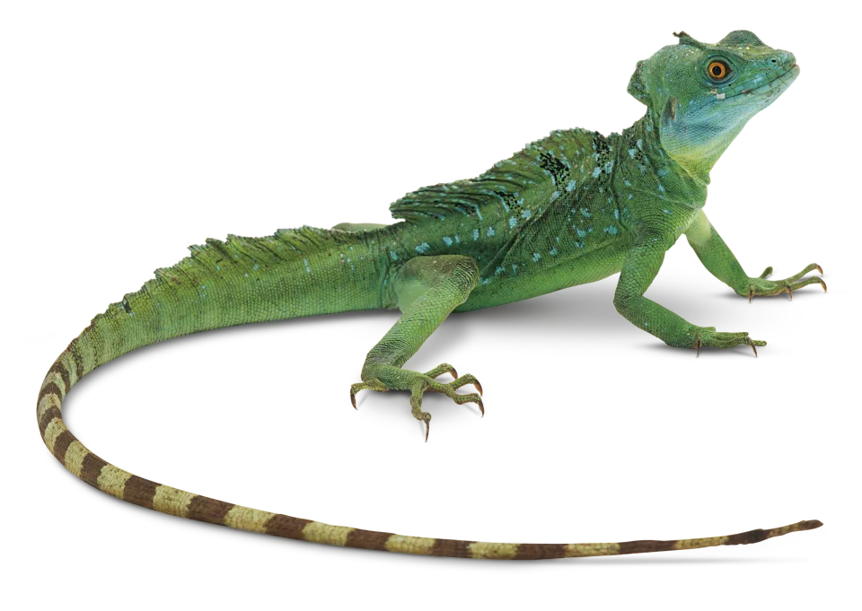
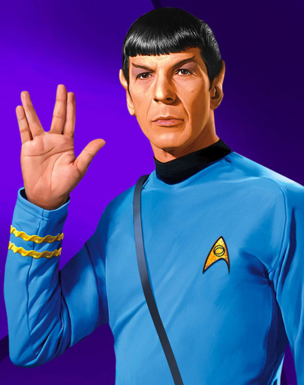

# Rock Paper Scissor Lizard Spock

Rock Paper Scissor Lizard Spock is a JavaScript game built to allow users to play the online for fun. It was built on an extended version of popualr Rock paper Scissor game what most of us plays in childhood.

[Live Link]

## Features

### Site wide

* 404 Page
    * A 404 page will be implemented and will display if a user navigates to a broken link.
    * The 404 page will allow the user to easily navigate back to the main website if they direct to a broken link / missing page, without the need  of the browsers back button.

*Home Page*

- Game Instructions
  - The home page content contains full game instructions so that the user is able to understand how to play the game.

  

*User Choice Buttons*

- A user will have five different buttons to choose the input on his/her turn. The options are as below.Each button has a pictorial representation of the options.
  - Rock
  
  - Paper 
  
  - Scissors
  
  - Lizards
  
  - Spock
  

 

