# Rock Paper Scissor Lizard Spock

Rock Paper Scissor Lizard Spock is a JavaScript game built to allow users to play the online for fun. It was built on an extended version of popualr Rock paper Scissor game what most of us plays in childhood.

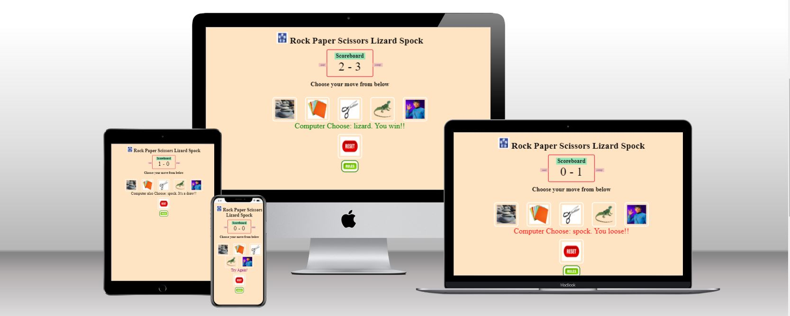

[Live link](https://rupa830904.github.io/Rock-Paper-Scissor-Portfolio2/)

## Features

### Site wide

* 404 Page
    * A 404 page will be implemented and will display if a user navigates to a broken link.
    * The 404 page will allow the user to easily navigate back to the main website if they direct to a broken link / missing page, without the need  of the browsers back button.


*Home Page*


- The home page demonstrated a user interactive game with rules and instructions as described below.

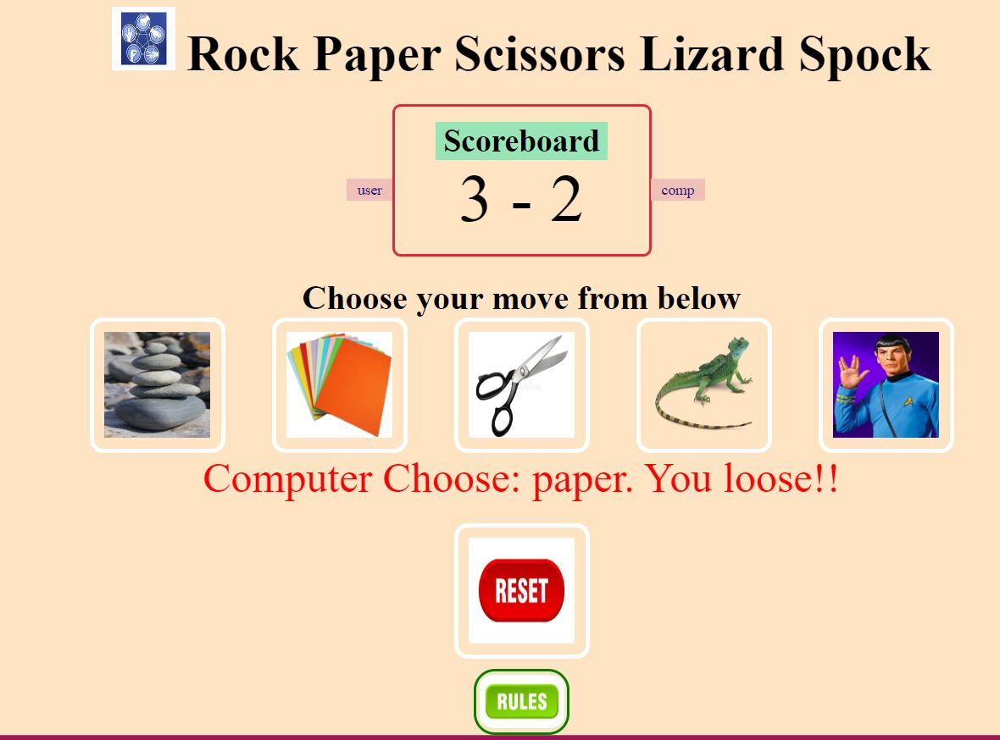  


*ScoreBoard*

- A user can see the current score between the user and computer in below screen.

  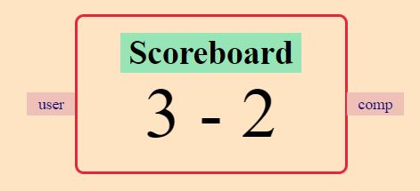

*User Choice Buttons*

- A user will have five different buttons to choose the input on his/her turn. The options are as below.Each button has a pictorial representation of the options.
  - Rock
  - Paper 
  - Scissors
  - Lizards
  - Spock
  
  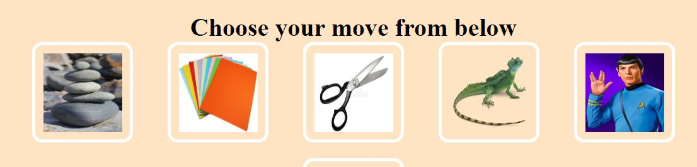

*Reset Button*

- A user has a choice to click on a reset button to reset the score board and restart the game.

 
 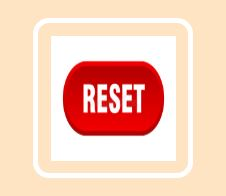

 *Rules Button*

 - This is a pop-up button. On user click it opens the game instructions and rules. User can click on the 'x' or anywhere outside the pop-up to come back to main page.

  
  


 *Result* 

 - There would be 3 results possible for each user choice. WIN/LOSS/DRAW. It will be decided on the below rule.
 
 *Game Rules*

 - A Simple Way to Remember Who Wins

   Scissors cuts paper.
   Paper covers rock.
   Rock crushes lizard.
   Lizard poisons Spock.
   Spock smashes scissors.
   Scissors decapitates lizard.
   Lizard eats paper.
   Paper disproves Spock.
   Spock vaporizes rock.
   Rock crushes scissors.

   *Example Results*

   - For a user choice of rock, comnputer chooses lizard then the user wins.
   
   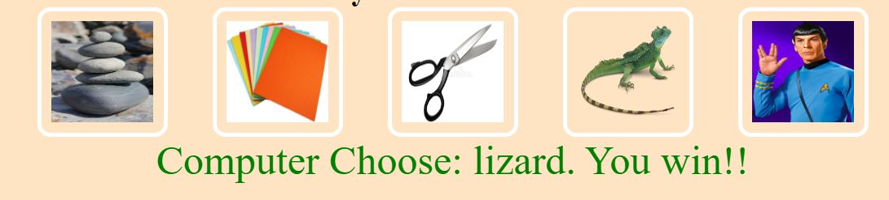

   - For a user choice of paper, comnputer chooses scissor then the user looses.

   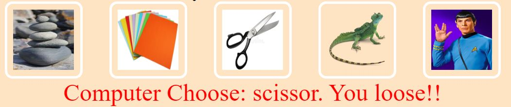

   - For a user choice of scissor, comnputer chooses paper then the user wins.

   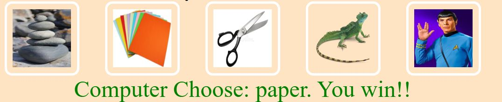

   - For a user choice of lizard, comnputer chooses spock then the user wins.

   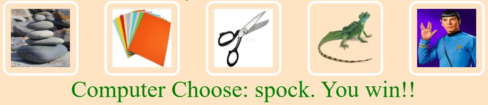

   - For a user choice of spock, comnputer chooses paper then the user looses.

   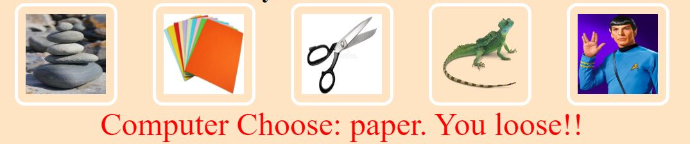

   - If the user's and computer's choice are same, it's a draw.

# Technolgies

- HTML
  - The structure of the Website was developed using HTML as the main language.
- CSS
  - The Website was styled using custom CSS in an external file.
- JavaScript
  - The game play logic was created using JavaScript in an external file.
- Visual Studio Code
  - The website was developed using Visual Studio Code IDE
- GitHub
  - Source code is hosted on GitHub and delpoyed using Git Pages.
- Git
  - Used to commit and push code during the development of the Website


## Testing

### Responsiveness

All pages were tested to ensure responsiveness on screen sizes from 320px and upwards as defined in [WCAG 2.1 Reflow criteria for responsive design](https://www.w3.org/WAI/WCAG21/Understanding/reflow.html) on Chrome and Edge.

Steps to test:

1. Open browser and navigate to [Live Link](https://rupa830904.github.io/Rock-Paper-Scissor-Portfolio2/)
2. Open the developer tools (right click and inspect)
3. Set to responsive and decrease width to 320px
4. Set the zoom to 50%
5. Click and drag the responsive window to maximum width.

Expected:

Website is responsive on all screen sizes and no images are pixelated or stretched.
No horizontal scroll is present.
No elements overlap.

Actual:

Website behaved as expected.

### Accessibility

[Wave Accessibility](https://wave.webaim.org/) tool was used throughout development and for final testing of the deployed website to check for any aid accessibility testing.

Testing was focused to ensure the following criteria were met:

- No erorrs or contrast error found.
- Color contrasts meet a minimum ratio as specified in [WCAG 2.1 Contrast Guidelines](https://www.w3.org/WAI/WCAG21/Understanding/contrast-minimum.html)
- WCAG 2.1 Coding best practices being followed.

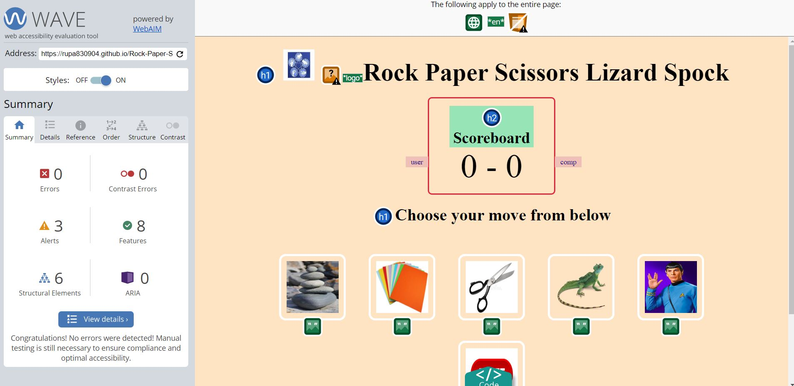

**Validator Testing**

- HTML
  - No errors were returned when passing through the official [W3C validator](https://validator.w3.org)

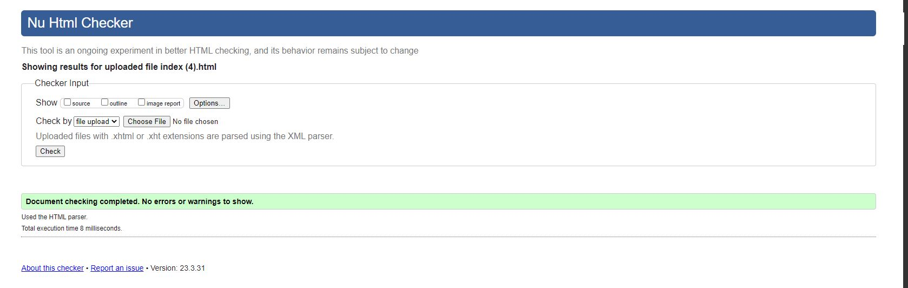

- CSS
  - No errors were found when passing through the official [(Jigsaw) validator](https://jigsaw.w3.org)

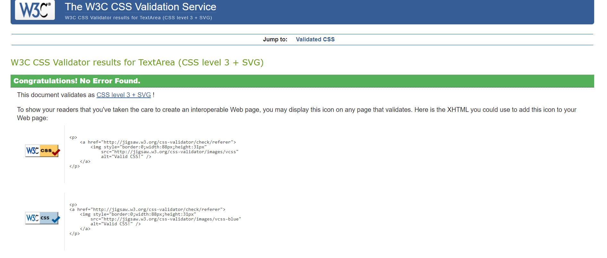

- JavaScript
  - No errors were returned when passing through the [JShint validator](https://jshint.com/)
  - A warning appeared for one function as an unused variable but the function is being used directly as an onkeyup event on the card divs.

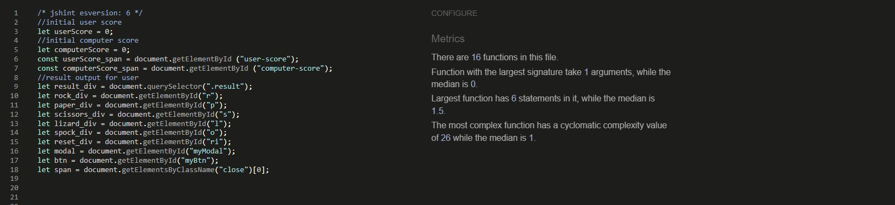

## Deployment

### Version Control

The site was created using the Visual Studio Code editor and pushed to github to the remote repository ‘Portfolio-Project-2-Poker-Fun’.

The following git commands were used throughout development to push code to the remote repo:

```git add <file>``` - This command was used to add the file(s) to the staging area before they are committed.

```git commit -m “commit message”``` - This command was used to commit changes to the local repository queue ready for the final step.

```git push``` - This command was used to push all committed code to the remote repository on github.

### Deployment to Github Pages

- The site was deployed to GitHub pages. The steps to deploy are as follows:
  - In the GitHub repository, navigate to the Settings tab
  - From the menu on left select 'Pages'
  - From the source section drop-down menu, select the Branch: main
  - Click 'Save'
  - A live link will be displayed in a green banner when published successfully.

The live link can be found here - https://rupa830904.github.io/Rock-Paper-Scissor-Portfolio2/

### Clone the Repository Code Locally

Navigate to the GitHub Repository you want to clone to use locally:

- Click on the code drop down button
- Click on HTTPS
- Copy the repository link to the clipboard
- Open your IDE of choice (git must be installed for the next steps)
- Type git clone copied-git-url into the IDE terminal

The project will now have been cloned on your local machine for use.

## Credits 


* Code was used from this site to create Modal button for game rules and instructions. Styles were changed to suit styling on my 
  Website. https://www.w3schools.com/howto/howto_css_modals.asp
* My Mentor Gareth-McGirr for his guidance and support throughout my project.
