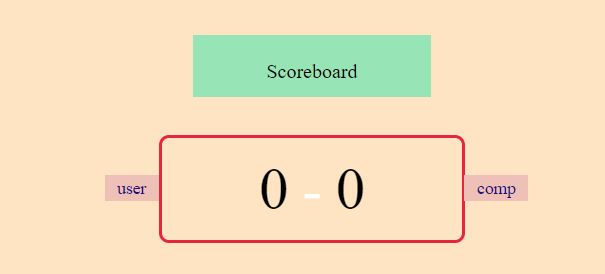

# Rock Paper Scissor Lizard Spock

Rock Paper Scissor Lizard Spock is a JavaScript game built to allow users to play the online for fun. It was built on an extended version of popualr Rock paper Scissor game what most of us plays in childhood.

[Live Link]

## Features

### Site wide

* 404 Page
    * A 404 page will be implemented and will display if a user navigates to a broken link.
    * The 404 page will allow the user to easily navigate back to the main website if they direct to a broken link / missing page, without the need  of the browsers back button.

*Home Page*

- Game Instructions
  - The home page content contains full game instructions so that the user is able to understand how to play the game.

  

*ScoreBoard*

- A user can see the current score between the user and computer in below screen.

  

*User Choice Buttons*

- A user will have five different buttons to choose the input on his/her turn. The options are as below.Each button has a pictorial representation of the options.
  - Rock
  - Paper 
  - Scissors
  - Lizards
  - Spock
  
  

*Reset Button*

- A user has a choice to click on a reset button to reset the score board and restart the game.

 - Reset button
 

# Technolgies

- HTML
  - The structure of the Website was developed using HTML as the main language.
- CSS
  - The Website was styled using custom CSS in an external file.
- JavaScript
  - The game play logic was created using JavaScript in an external file.
- Visual Studio Code
  - The website was developed using Visual Studio Code IDE
- GitHub
  - Source code is hosted on GitHub and delpoyed using Git Pages.
- Git
  - Used to commit and push code during the development of the Website

## Testing

### Responsiveness

All pages were tested to ensure responsiveness on screen sizes from 320px and upwards as defined in [WCAG 2.1 Reflow criteria for responsive design](https://www.w3.org/WAI/WCAG21/Understanding/reflow.html) on Chrome and Edge.

Steps to test:

1. Open browser and navigate to [Live Link]()
2. Open the developer tools (right click and inspect)
3. Set to responsive and decrease width to 320px
4. Set the zoom to 50%
5. Click and drag the responsive window to maximum width.

Expected:

Website is responsive on all screen sizes and no images are pixelated or stretched.
No horizontal scroll is present.
No elements overlap.

Actual:

Website behaved as expected.

 

